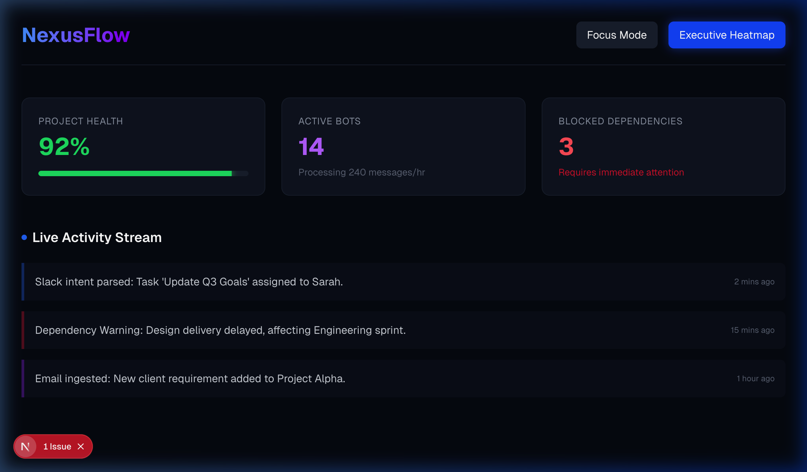
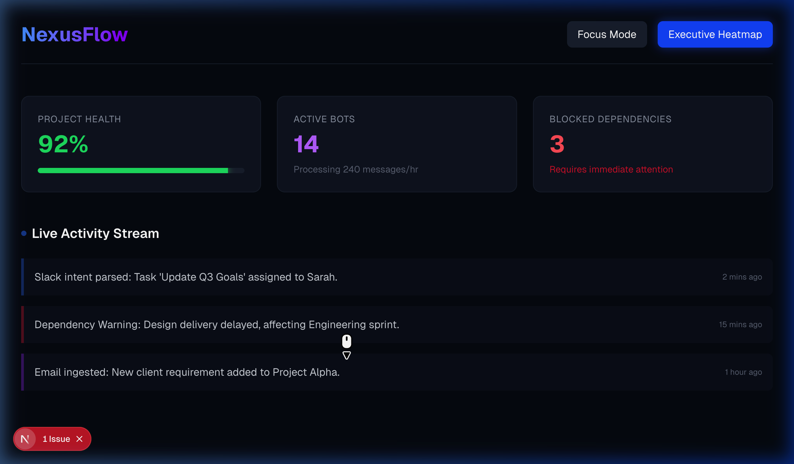
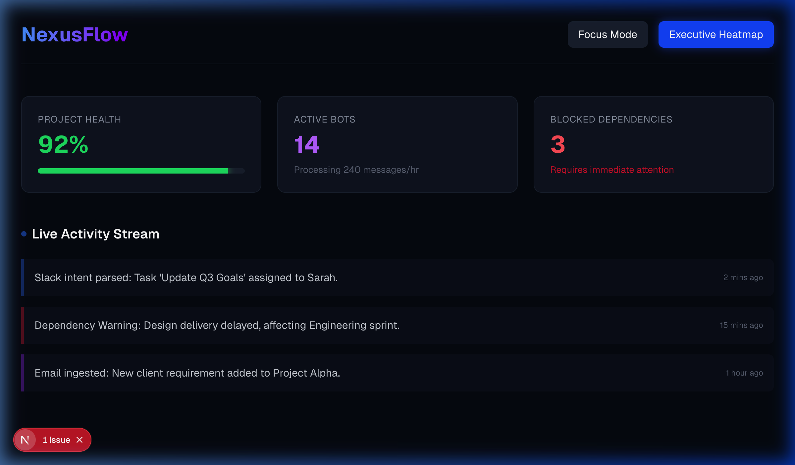

# How to Use NexusFlow

This guide will walk you through interacting with the NexusFlow MVP using the built-in UI Webhook Simulator.



## 1. Access the Dashboard
When you open the application, you will land on the **Executive Heatmap**. 
This view provides a high-level overview of:
- **Project Health:** The overall status percentage of your operations.
- **Active Bots:** The number of AI agents currently processing data streams.
- **Blocked Dependencies:** A critical counter showing how many tasks are currently halting progress.
- **Live Activity Stream:** A running log of all parsed events happening in your organization.

## 2. Simulate Webhook Ingestion (In-line Actioning)
At the bottom of the screen, you will see a sticky input bar labeled **Webhook Simulator**. Because this MVP does not have a live Slack/Teams workspace attached, this simulator allows you to mock incoming chat messages.



### Action A: Creating a Task
1. Click the simulator input box.
2. Type a natural language command, such as:
   > *"Schedule a meeting with the client for tomorrow to review the wireframes."*
3. Click **Send**.
4. **Observe the result:** The backend AI parses the intent (`create_task`). You will instantly see a new entry appear in the Live Activity Stream on the Heatmap!

### Action B: Blocking a Dependency
1. In the simulator input box, type a message indicating a delay, such as:
   > *"Delay the database migration by 3 days due to server issues."*
2. Click **Send**.
3. **Observe the result:** The backend parses the intent (`update_status`). Watch the **Project Health** score instantly drop, the **Blocked Dependencies** counter increase, and a red alert appear in the Activity Stream!

## 3. Navigate to Focus Mode
While the Heatmap is for executives, Individual Contributors need a clean workspace.



1. At the top right of the navigation bar, click **Focus Mode**.
2. You will now see your personal queue of Action Items.
3. You will see the task you created in *Action A* sitting in the queue marked as **PENDING**.
4. You will also see the task affected by *Action B* marked clearly in red as **BLOCKED**.

## 4. Local Development
If you want to run the stack locally on your machine instead of using the Cloud Run URLs:

**Terminal 1 (Backend):**
```bash
cd backend
python -m venv venv
source venv/bin/activate
pip install -r requirements.txt
uvicorn app.main:app --host 0.0.0.0 --port 8000 --reload
```

**Terminal 2 (Frontend):**
```bash
cd frontend
npm install
npm run dev
```
Open `http://localhost:3000` in your browser. (Ensure you update the `API_BASE_URL` in `page.tsx` back to `http://localhost:8000/api` for local testing).
